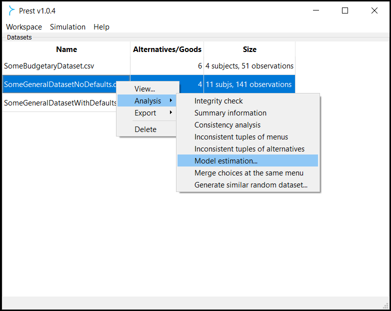
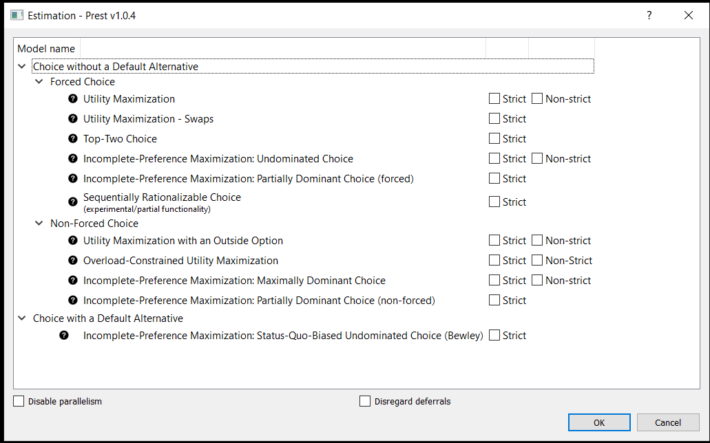

.. _estimation:

Preference Estimation
=====================

For **general/non-budgetary datasets**, Prest can estimate non-parametrically which model(s) in its 
toolkit is the best match for a given subject in the dataset by identifying "how far" each model is from fully explaining 
that person's choices. 

Generalizing the :cite:authors:`houtman-maks85` :cite:yearpar:`houtman-maks85` method 
in the *model-based* way that was first suggested in :cite:authors:`CCGT22` :cite:yearpar:`CCGT22`,  
Prest computes the **distance score** 
associated with every user-selected model for every subject in the dataset. 

This score corresponds to the number of observations 
that need to be removed from a subject's data in order for the remaining observations to be fully compatible with the model in question. 

Prest also provides information about the compatible *instances* of every model that is optimal in this sense.

.. note::
     Since the release of Prest 1.1 users can also visualize this preference-estimation output and save it in .png format. This service builds on `GraphViz <https://graphviz.org>`_ and requires GraphViz to be installed and its 'dot' binary file
     to be available in Prest's root directory. Users can then view and save the directed preference graph that corresponds to some instance
     of a model used in estimation by right-clicking and viewing the relevant model-estimation dataset in the workspace, locating the subject, model
     and instance of interest from the relevant list, and clicking on the question mark icon that appears next to the code label of that instance.

These model- and preference-estimation features allow you to analyse the available data to test for the proximity of choice behaviour 
not only with utility maximization but also with several models of general choice that explain well-documented behavioural phenomena 
such as **context-dependent choices**, **cyclic choices**, **status-quo biased choices**, **choice deferral** and **choice overload**.

|

| 

| 

.. note::  
     Prest's core program is designed to utilise all of your computer's CPU power by simultaneously engaging all its cores, by default.
     You can change that by checking the *"Disable parallelism"* box at the bottom of the *"Model estimation"* window.

.. note::  
     If your dataset includes observations where the deferral/outside option was chosen and you wish to ignore
     these observations, you can do so by checking the *"Disregard deferrals"* box at the bottom of the *"Model estimation"* window.

|

.. toctree::
    fc
    nfc
    default
