Prest Menu
==========

Workspace area
--------------

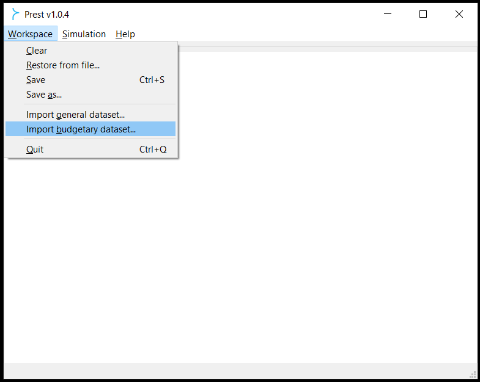

| 

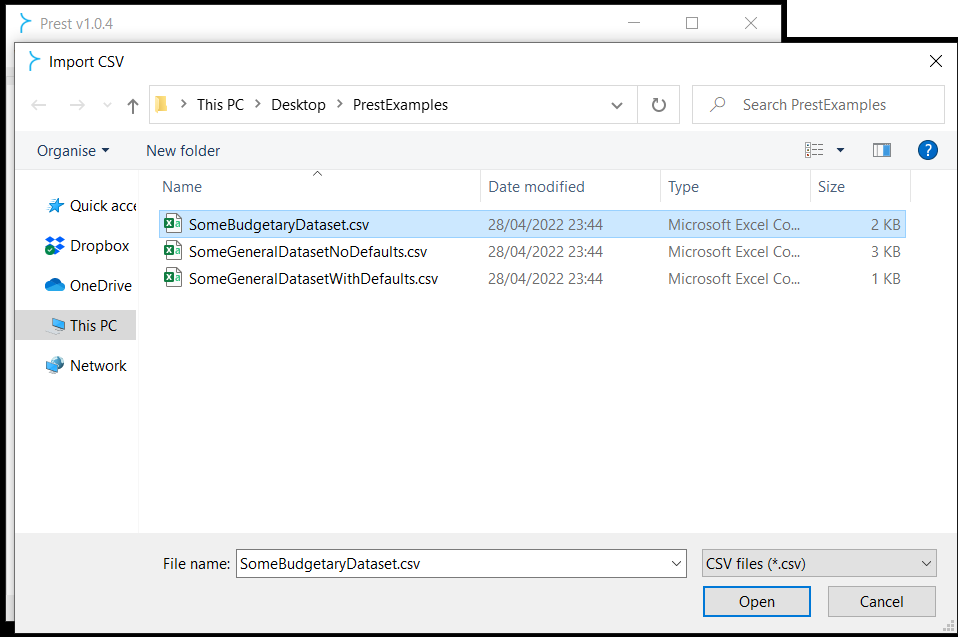

|

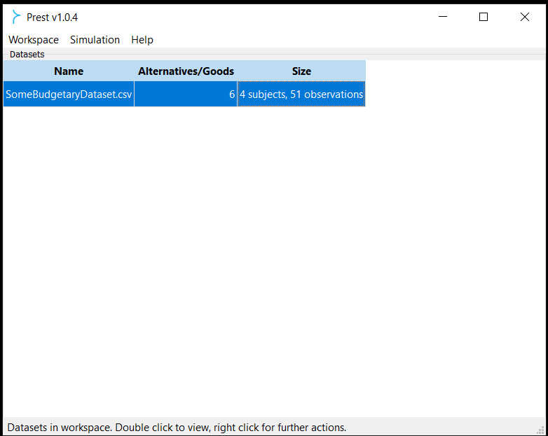

| 

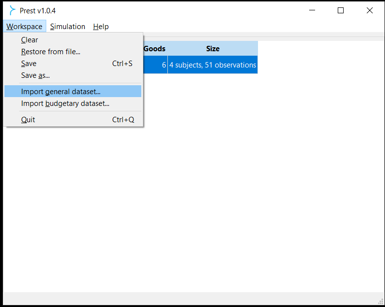

| 

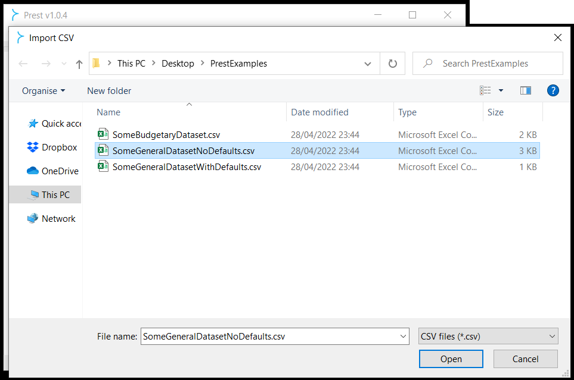

| 

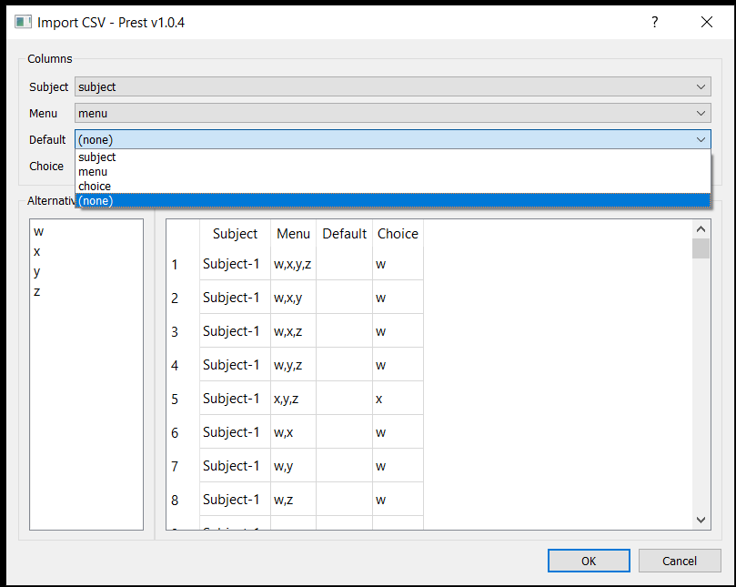

|

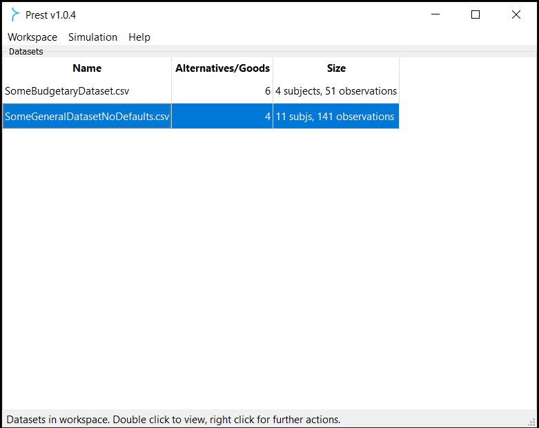

| 

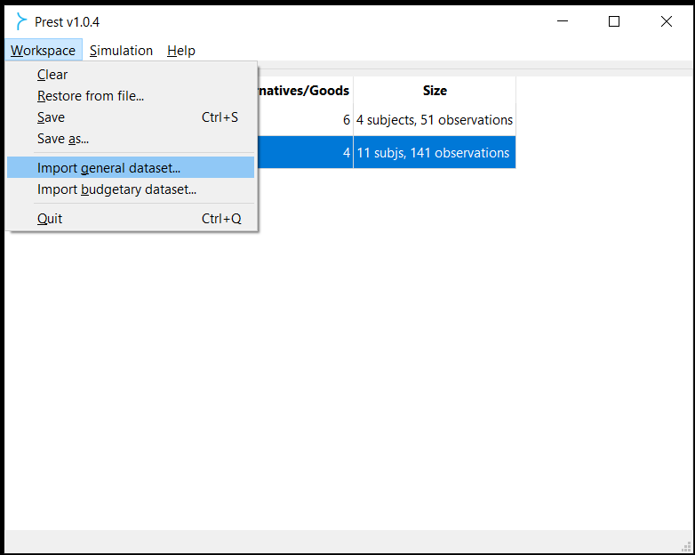

| 

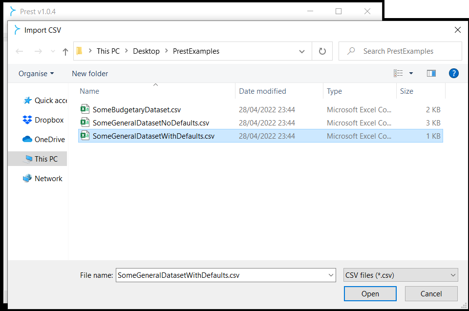

| 

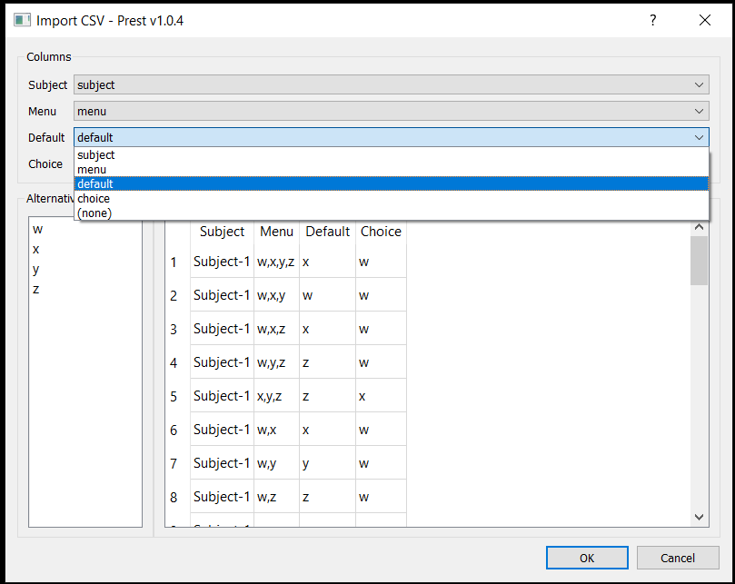

|

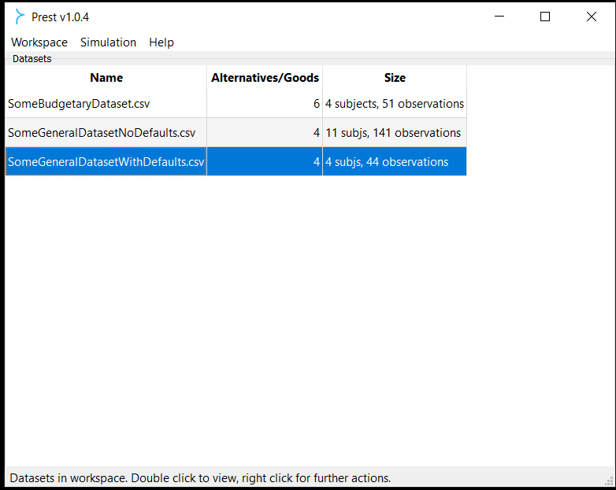

|

Prest's **workspace** is the area where imported/Prest-generated datasets
are available for analysis and exporting.

Its three columns provide the following information about all datasets listed there:

| *"Name"*. The name of the dataset, as imported from file or specified by you through a Prest operation.
   
| *"Alternatives/Goods"*. Depending on whether the dataset in question is :ref:`general <general-datasets>` or :ref:`budgetary <budgetary-datasets>`, the total number of alternatives or goods in that dataset is shown, respectively.
   
| *"Size"*. The total number of subjects and observations in the dataset.

Right-clicking on a dataset in the workspace area leads to the following options:

*"View"*. Displays the contents of the dataset in a separate window (can also be done by double-clicking on the dataset).
   
*"Analysis"*. See below for the available options depending on whether 
the selected dataset is :ref:`general <general-datasets>` or :ref:`budgetary <budgetary-datasets>`.

**General datasets**

| 1. *"Integrity check"*. This option examines whether:
|    (a) the specified choices in the dataset are indeed elements of the corresponding menus of alternatives;
|    (b) any menus are repeated more than once for a given subject in the dataset.
| A detailed report/dataset is produced if either of the above is true.

| 2. *"Summary information"*. This option generates a new dataset that gives the following counts per subject: 
|    (a) *"Observations"*.
|    (b) *"Active choices"* (number of times where the outside option -if feasible-  was *not* chosen).
|    (c) *"Deferrals"* (number of times where the outside option *was* chosen).
| The dataset resulting from this operation is named after the original dataset following insertion of the "(info)" suffix. 
| For example, *"DatasetX"* becomes *"DatasetX (info)"*, while *"DatasetX"* is also kept in the workspace.
			   
| 3. *"Deterministic consistency analysis"*. Details :ref:`here <general-consistency-tip>`. 

| 4. *"Stochastic consistency analysis"*. Details: :ref:`here <stochastic-consistency-tip>`.

| 5. *"Inconsistent tuples of menus"*. Details :ref:`here <menu-tuples>`. 
		
| 6. *"Inconsistent tuples of alternatives"*. Details :ref:`here <alternative-tuples>`.

| 7. *"Model estimation"*. Details :ref:`here <estimation>`.

| 8. *"Merge choices at the same menu"*. Details :ref:`here <merging-tip>`.

| 9. *"Generate similar random dataset"*. Details :ref:`here <similar-random-dataset>`.
       	 
.. tip::  
     When importing a general-dataset .csv file, you will be prompted to match the column headers in the file 
     with the relevant Prest headers from *"Subject"*, *"Menu"*, *"Default"* and *"Choice"*. 
     See screenshots above for an illustration.

**Budgetary datasets** 

| 1. *"Consistency analysis"*. Details :ref:`here <budgetary-consistency-tip>`.

| 2. *"Export"*. This allows for exporting the selected dataset in .xlsx or .csv format. 
| Special remarks for this option:
|     (a) Dataset derived from *"Model estimation"* (details :ref:`here <estimation>`):
|          i.   *"Compact (human-friendly)"*. Leaves the subject column blank in all but the first row 
|               whenever there are multiple compatible models for a given subject.
|          ii.  *"Detailed (machine-friendly)"*. Includes subject information in every row.
|     (b) Dataset derived from *"Consistency analysis"* (details :ref:`here <general-consistency-tip>`):
|          i.   *"Summary"*.
|          ii.  *"WARP violations"*.
|          iii. *"Congruence violations (wide)"*.
|          iv.  *"Strict general cycles (wide)"*.
|          v.   *"Strict binary cycles (wide)"*.
|          vi.  *"Binary cycles (wide)"*.

| 3. *"Delete"*. Removes the selected dataset from the workspace area.

Drop-down menu options
----------------------

**Workspace**.

(1) *"Clear"*. Removes all datasets from the workspace area.
	  
(2) *"Restore from file"*. Opens an existing Prest workspace file (.pwf) from the relevant directory.
	  
(3) *"Save"*. Saves the active Prest workspace file in the current location.
	  
(4) *"Save as"*. Allows to choose the location where the active Prest workspace file will be saved.
	  
(5) *"Import general dataset"*. Details :ref:`here <general-datasets>`.
	  
(6) *"Import budgetary dataset"*. Details :ref:`here <budgetary-datasets>`.
	  
(7) *"Quit"*. Exits Prest.

**Simulation**. Details :ref:`here <direct-simulations>`.
  
**Help**.

(1) *"Prest manual"*. Opens the embedded Prest documentation pages on your web browser.

(2) *"About"*. Opens a dialog with information about Prest's version, contributors, copyright and license. 	  
